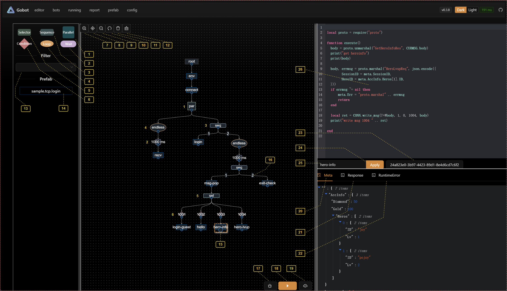

# Editor View

### Added in v0.4.4
Double-clicking on a `script node` will create a breakpoint marker on the left. When you click on the "Run to End" button, the execution will stop at nodes marked with breakpoints.

---

### Behavior Tree Nodes (1 - 6)
1. Parallel - Parallel Node
2. Wait - Wait Node (Milliseconds)
3. Sequence - Sequence Node
4. Loop - Loop Node
5. Selector - Selector Node
6. Condition - Condition Node
> For more detailed information on behavior trees

### Editor Window Features (7 - 12)
7. ZoomIn - Zoom In View
8. Reset - Reset View Size
9. ZoomOut - Zoom Out View
10. Undo - Undo One Step of Behavior Tree Operation (Shortcut: control + z)
11. Delete - Delete a Node (Shortcut: del)
12. Clean - Clear the Behavior Tree in the Current View

### Prefab Node Area (13 - 14)
13. Filter - Filter, filter related prefab nodes by characters
14. Prefab node - Prefab Node, common nodes pre-written in prefab, can be dragged directly into the view for use

### Behavior Tree Debugging Tips (15 - 19)
15. Yellow dashed box selection - indicates the node is selected
16. 2 indicates this node is the second node of the sequence (sometimes dragging nodes back and forth can disrupt the actual execution order)
17. Debug - Start debugging (create a debugging robot for the current view)
18. Step - Step Execution
19. Upload - Upload the current view's robot to bots for management

### Debugging Information (20 - 22)
20. Blackboard - Robot Blackboard Information Panel (contains all robot properties, scope is the robot itself)
21. Response - When the robot executes to a node, the return value information of the node will be displayed here (if there are parallels, there will be multiple pieces of information)
22. Runtime Error - Error information encountered when running to a node

### Node Information (23 - 26)
23. Display the unique ID of the node
24. When the script or parameters of a node are modified, click apply to apply
25. Node name (will be displayed in the view)
26. Node script editing window

